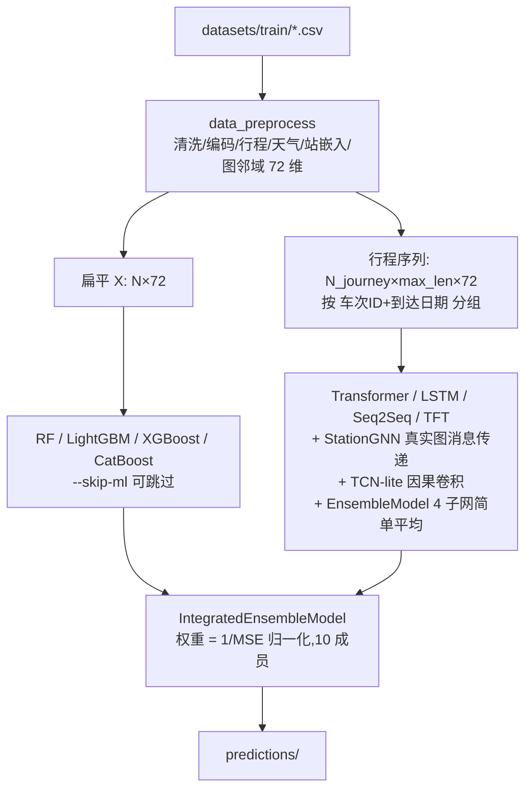

# 火车延误预测系统

预测高铁沿途各停站到达延误分钟数(正=晚点,负=早点,0=准点)。当前架构:**72 维特征**(含 16 维站点距离 embedding + 21 维图邻域特征)→ **7 个行程序列深度学习模型(含 StationGNN / TCN-lite)+ 4 个可选传统机器学习模型** → 按 MSE 倒数加权集成。

---

## 1. 当前效果(最近一次完整训练)

> 下表为**51 维特征时代**的历史结果(接入图特征与 2 个新模型之前),供架构对比参考;72 维特征 + 7 DL 的完整重训结果以最新一次 `train.py` 输出为准。

验证集为按「到达日期」尾部留出的 10%(与训练集同量纲,**Val MSE = 延误分钟²**,可直接横向比较):

| 模型 | 类型 | Val MSE |
|---|---|---|
| Transformer | DL 序列 | **2.66** |
| TFT | DL 序列 | 3.00 |
| Seq2Seq | DL 序列 | 3.49 |
| Ensemble(DL 简单平均) | DL 序列 | 3.77 |
| LSTM | DL 序列 | 4.67 |
| Random Forest | ML 扁平 | 14.61 |
| LightGBM | ML 扁平 | 15.21 |
| XGBoost | ML 扁平 | 15.30 |
| CatBoost | ML 扁平 | 16.42 |

结论:**序列 DL 全面优于扁平 ML**(Transformer 好 5.5 倍)。集成权重由 `train_integrated_ensemble.py` 在验证集上按 MSE 倒数自动计算,每次重训更新(权重示例见 `model/integrated_ensemble_info.pkl`)。

---

## 2. 快速开始

```bash
pip install -r requirements.txt

# (可选)增量更新全路网里程数据:1 次列表页请求 + 只抓新增/变更线路,通常几秒
python fetch_jprailfan_mileage.py --all-lines          # --force 强制全量重抓

# (可选)由 network.json 重建站点距离 embedding(已有 model/station_embedding.pkl 时可跳过)
python build_station_embedding.py --from-json datasets/network.json --k 16

# (可选)超参数随机搜索并保存最优参数(train.py 会自动读取)
python tune_models.py --save

# 完整训练:7 个 DL(含 StationGNN/TCN-lite)+ 4 个 ML
python train.py                    # --skip-ml 跳过 ML;--epochs N 控制轮数(默认 500)

# 计算集成权重(验证集 MSE 倒数加权)
python train_integrated_ensemble.py

# 集成预测 → predictions/
python predict_integrated_ensemble.py

# (可选)embedding 2D 可视化 → outputs/station_embedding_map.png
python plot_station_embedding.py
```

---

## 3. 架构总览(与代码一致)



- **DL 与 ML 用同一套 72 维特征**:ML 吃扁平矩阵;DL 吃行程序列(站序为时间步,`MaskedMSELoss` 只在真实站点计算)。
- 划分:`split_by_date` / `split_sequence_by_date` —— 按到达日期排序取尾部 10% 日期留出,避免按日恒定的天气特征成为日期指纹泄漏。

---

## 4. 数据格式

训练 CSV(`datasets/train/`,每日期一个文件):

| 列名 | 说明 |
|---|---|
| `车次ID` / `车站名` | 车次与车站(LabelEncoder 编码,未知→0) |
| `到达日期` / `到达时间` / `出发日期` / `出发时间` | 时刻信息 |
| `延误分钟` | 目标值(测试集无此列) |
| `当日最高温` 等 11 列天气 | 见特征表;文本列「天气情况」与空列「距离」不使用 |

无效行(`_drop_invalid_rows`)自动丢弃;所有 NaN 最终 `nan_to_num(0)`。

---

## 5. 特征工程(共 72 维,`data_preprocess.py`)

| 块 | 维数 | 内容 |
|---|---|---|
| `BASE_FEATURES` | 14 | 出发小时/分钟/月份/日/星期、车站编码、车站×小时、车站×星期、小时×星期交互、到达小时/分钟、到达时间_小时/分钟/小时_分钟 |
| 车次编码 | 1 | `车次ID` LabelEncoder |
| `JOURNEY_FEATURES` | 9 | 站序、行程站点数、站序占比、是否始发/终到站、**前一站延误分钟、累计延误分钟**、停站时长、站间运行时间(按 车次ID+到达日期 分组沿停站顺序计算;测试集无延误列,这两列归零) |
| `WEATHER_FEATURES` | 11 | 最高/最低温、降水量/降雨量/降雪量、降水小时数、最大风速/阵风、云量、相对湿度、天气代码 |
| `st_emb_0..15` | 16 | 站点距离 embedding(见下节) |
| `GRAPH_TOPO_FEATURES` | 3 | `st_deg` 邻站数(枢纽性)、`st_nlines` 所在线路数、`st_nb_dist_mean` 平均邻站距离 |
| `GRAPH_HIST_FEATURES` | 2 | `st_hist_delay` 本站历史均值延误、`stnb_hist_delay` 距离反比加权的邻站历史均值延误 |
| `stnb_emb_0..15` | 16 | 邻居站嵌入的距离反比加权均值(一层"平均图卷积") |

**图历史特征防泄漏设计**(`add_graph_hist_features`):
- 训练路径(df 含延误列):按日 expanding、**shift 1 天** —— 每行只用严格早于自身日期的标签,因果、零泄漏;首日冷启动为 0;
- 测试路径(无延误列):查 `model/graph_hist_state.pkl`(训练结束时 `save_graph_hist_state` 保存的每站全期均值),不更新。

> 注:当前实现为原始数值特征(无 sin/cos 周期编码、无周末/节假日标志)。

---

## 6. 站点距离 embedding 子系统

纯地理属性、与延误标签无关,**无验证集泄漏**。

### 6.1 数据抓取 `fetch_jprailfan_mileage.py`
- 数据源:黄河铁路网 jprailfan.com「车站信息查询」。
- 单线模式:`--lines 京广高速线` → `datasets/station_mileage.csv`。
- **全路网增量模式**:`--all-lines` —— 一次请求解析 758 条线路的「总里程」作变更指纹,与 `network.json` 中 `meta.total_km` 比对(±0.5km),只重抓新增/变更线路;`--force` 全量;失败线路自动重试。
- 现状:758 线 / 6660 站点行 / 去重 4981 站。

### 6.2 嵌入构建 `build_station_embedding.py`
- 全路网模式:`--from-json datasets/network.json` —— 每条线路相邻站区间为图边(权=累计里程差,多线取最小)→ 全成对**最短路距离**(不连通对封顶 2×max,约 0.44%)→ MDS 16 维。
- 单线模式:`--mileage`(保留兼容)。
- 输出 `model/station_embedding.pkl`:{站名: 16 维向量},4981 站。
- 质量抽查:嵌入欧氏距离与真实铁路里程高度线性一致(如 北京西→郑州东 714/686)。

### 6.3 消费与 OOV 回退(`data_preprocess.py`)
查找链:**精确命中 → alias(`北京西`/`北京`→`北京丰台`)→ 城市级前缀回退 → 全表均值**。
- 城市级回退:从 4981 个站名自动聚类(共享前缀且 ≥2 站成城,共 957 簇),按 5>4>3>2 字最长前缀匹配,命中返回该城市均值向量(带缓存)。
- `model/station_embedding.pkl` 不存在时,`st_emb_*` 特征层自动跳过(51→35 维,向后兼容)。
- 注意:重新生成 pkl 时 `--k` 必须与已训模型一致(现为 16,否则特征维度不匹配需重训)。

### 6.4 可视化 `plot_station_embedding.py`
最大连通分量 2D MDS + 枢纽 Kabsch 地理定向 → `outputs/station_embedding_map.png`(干线走向、京广高速线、训练集 44 站标注)。

---

## 7. 模型清单(`models.py`)

所有 DL 模型统一签名 `forward(x, lengths)`,输入 `(batch, seq_len, 51)`,输出逐站 `(batch, seq_len)`;损失 `MaskedMSELoss`(原始分钟²,padding 掩码)。

| 模型 | 结构要点 | 产物 |
|---|---|---|
| `TransformerPredictor` | 线性投影→位置编码→TransformerEncoder→逐站 MLP | `model/transformer_best.pth` |
| `LSTMPredictor` | 多层 LSTM→末步 FC | `model/lstm_best.pth` |
| `Seq2SeqPredictor` | LSTM 编码器→自注意力→FC | `model/seq2seq_best.pth` |
| `TFT` | Temporal Fusion Transformer 风格 | `model/tft_best.pth` |
| `StationGNN` | 全站可学习节点嵌入 + 2 层加权图卷积(真实铁路网 kNN 图,边权=最短路距离反比),逐时间步与序列上下文融合;~25k 参数 | `model/stgnn_best.pth` |
| `TCNLite` | 2 层因果 dilated Conv1d + 残差,逐站输出;~19k 参数 | `model/tcnlite_best.pth` |
| `EnsembleModel` | 上述 4 子网简单平均(作为独立可训成员) | `model/ensemble_best.pth` |
| RF / LightGBM / XGBoost / CatBoost | 扁平 51 维;默认参数被 `model/best_params.json` 覆盖 | `model/*_best.pkl` |

训练超参(`train.py`):Adam(lr=1e-3, wd=1e-5)、ReduceLROnPlateau(patience=10, factor=0.9)、500 epochs、早停 patience=50、batch=32、MaskedMSELoss。

---

## 8. 集成机制(`integrated_ensemble.py`)

`IntegratedEnsembleModel`:
1. 加载 7 个 DL(`*_best.pth`,StationGNN 先加载 `station_graph_gnn.pkl` 注入图)与 4 个 ML(`*_best.pkl`,缺失/失效自动跳过);
2. `calculate_weights`:在按日期留出的验证集上,DL 行程序列预测经 `flatten_sequence_predictions` 摊平对齐原始行序,连同 ML 预测各算 MSE,**权重 = 1/(MSE+ε) 归一化**;
3. `predict`:全体加权平均(缺成员自动跳过并归一化);
4. 权重保存到 `model/integrated_ensemble_info.pkl`(仅 weights)。

> 无 stacking / bootstrap;`train_integrated_ensemble.py` 只重算权重,不训练子模型。

---

## 9. 超参搜索(`tune_models.py`)

对 4 个 ML 模型随机搜索(默认每模型 20 组),按日期留出验证,最优参数写入 `model/best_params.json`:

```bash
python tune_models.py --trials 40            # 每模型 40 组
python tune_models.py --models xgboost lightgbm --save   # 指定模型并保存
```

`train.py` 训练 ML 时自动读取该文件覆盖默认参数。

---

## 10. 预测

- `predict_integrated_ensemble.py`:测试集 → 编码(用训练侧保存的编码器,未知站/车次→0)→ 扁平 + 行程序列一次前向 → 加权集成 → `predictions/prediction_results_integrated_ensemble_<测试文件>.csv`(保留 2 位小数,不裁剪)。
- `predict.py`:加载单个/全部 DL 模型(`*_best.pth`)直接预测,用于对比。

---

## 11. 增量训练(`incremental_train.py`)

从 `datasets/incremental/train/` 读取新数据,复用已保存的车站/车次编码器(未知→0),`prepare_train_data` 后按日期留出验证,对已训 DL 模型低学习率继续训练并保存。

---

## 12. 文件清单

| 文件 | 说明 |
|---|---|
| `data_preprocess.py` | 数据加载、清洗、51 维特征、行程序列、按日期划分、MaskedMSELoss、站嵌入消费与 OOV 回退 |
| `models.py` | Transformer / LSTM / Seq2Seq / TFT / EnsembleModel |
| `train.py` | 完整训练:5 DL(序列)+ 4 ML(扁平),读取 best_params.json |
| `tune_models.py` | ML 超参随机搜索 → best_params.json |
| `integrated_ensemble.py` | MSE 倒数加权集成器 |
| `train_integrated_ensemble.py` | 在验证集上计算并保存集成权重 |
| `predict.py` / `predict_integrated_ensemble.py` | 单模型 / 集成预测 |
| `incremental_train.py` | 新数据继续训练 |
| `fetch_jprailfan_mileage.py` | jprailfan 里程抓取(单线 / 全路网增量) |
| `build_station_embedding.py` | 最短路 + MDS 站嵌入构建 |
| `plot_station_embedding.py` | 站嵌入 2D 可视化 |

---

## 13. 模型产物(`model/`)

| 文件 | 说明 |
|---|---|
| `ensemble/transformer/lstm/seq2seq/tft/stgnn/tcnlite_best.pth` | 7 个 DL 权重 |
| `station_graph_gnn.pkl` | GNN 图(edge_index/edge_weight/num_nodes,kNN=5) |
| `graph_hist_state.pkl` | 站点历史延误状态(测试路径图历史特征查表) |
| `random_forest/lightgbm/xgboost/catboost_best.pkl` | 4 个 ML 模型 |
| `best_params.json` | tune_models.py 最优超参 |
| `integrated_ensemble_info.pkl` | 集成权重 |
| `label_encoder.pkl` / `train_label_encoder.pkl` | 车站 / 车次编码器 |
| `station_embedding.pkl` | 4981 站 × 16 维距离嵌入 |
| `backup_pre_gnn/` | 72 维图特征接入前的旧权重存档 |

---

## 14. 依赖

`requirements.txt`:torch、pandas、numpy、scikit-learn、lightgbm、xgboost、catboost、tqdm。

另需(未列入 requirements,按需安装):
- `scipy` —— `build_station_embedding.py` 的最短路计算;
- `matplotlib`(可选 `adjustText`)—— `plot_station_embedding.py`。

---

## 15. 已知事项与易错点

1. **ML 与 DL 指标同量纲**(均为原始分钟²上的 MSE),可直接比较;当前序列 DL 显著更优。
2. **特征维度契约**:72 = 51(35 基础 + 16 站嵌入)+ 21(3 拓扑 + 2 历史 + 16 邻居嵌入)。重新生成 `station_embedding.pkl` 时 `--k` 改动会导致与已训模型维度不匹配;`network.json` 缺失时图特征自动降级为 0(维度不变)。
3. **OOV 车站**三级回退(城市前缀 → 全表均值),不会报错但长名单站城市(如「乌兰察布」仅 1 站不成簇)会落到更粗粒度;必要时往 `_STATION_EMB_ALIAS` 手工加别名。
4. **StationGNN 的列依赖**:从输入张量第 5 列读取『车站编码』索引图节点——若调整 `BASE_FEATURES` 顺序必须同步修改 `StationGNN.STATION_CODE_COL`。
5. **训练站间直连边稀疏**:44 训练站在铁路网上直接相邻的仅 11 对,故 GNN 图用**全网最短路 + k 近邻(knn=5)**建边(131 条,中位距离 199km),物理含义为"延误向铁路网上最近的训练站传播"。
6. **测试集行程滞后特征**(`前一站延误分钟`/`累计延误分钟`)因无延误列而归零——这是 DL 测试 MSE 通常高于训练验证值的原因之一。
7. 验证集按**日期尾部**留出而非随机打散:天气按日恒定,随机切分会泄漏日期指纹。
8. 预测值**不裁剪**(负值=早点),评估口径保持一致。
9. `python/` 为空目录占位;历史文档中的 `config.py`、`optimizations.py`、`incremental/` 包、NeuralODE、Stacking 等在当前代码中**不存在**;TCN-lite 与 StationGNN 现已实现,以本文档为准。
